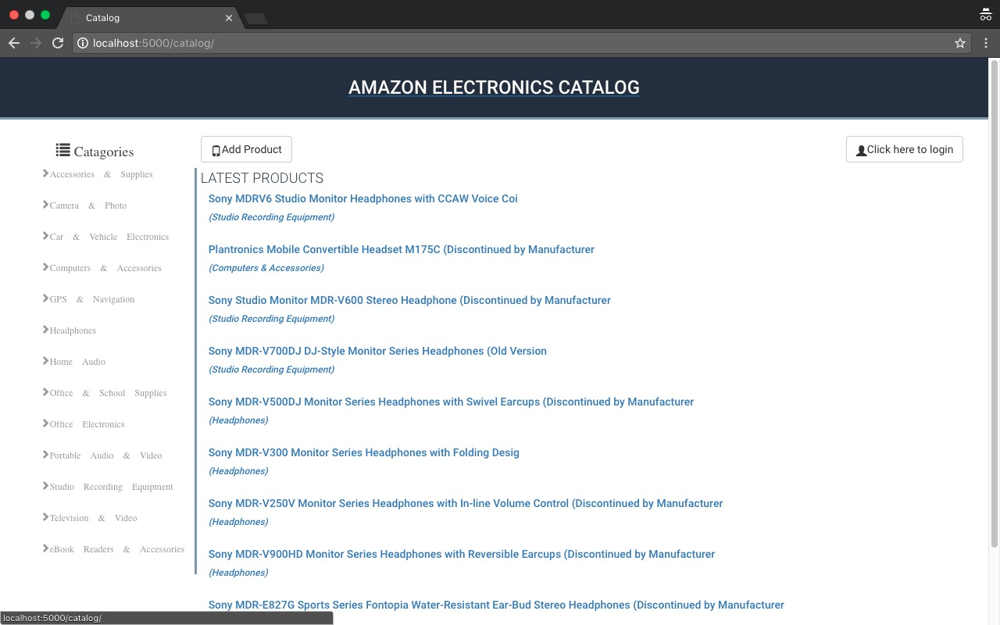
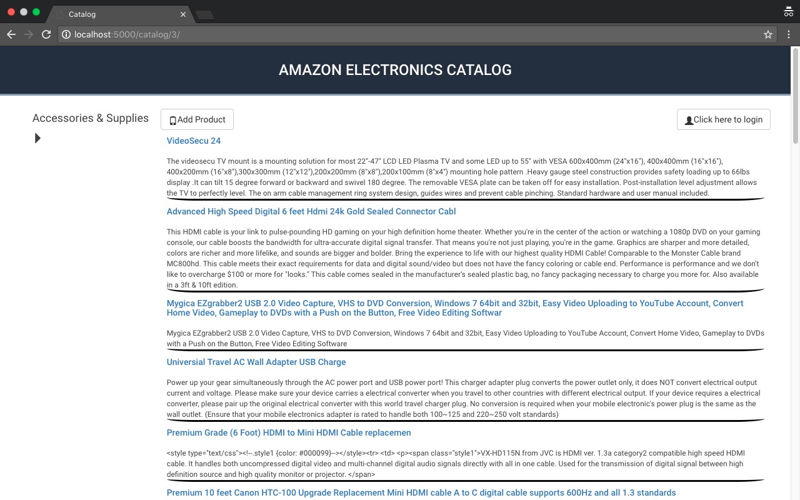
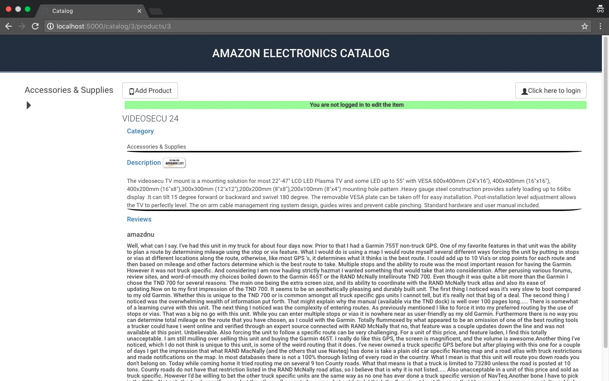
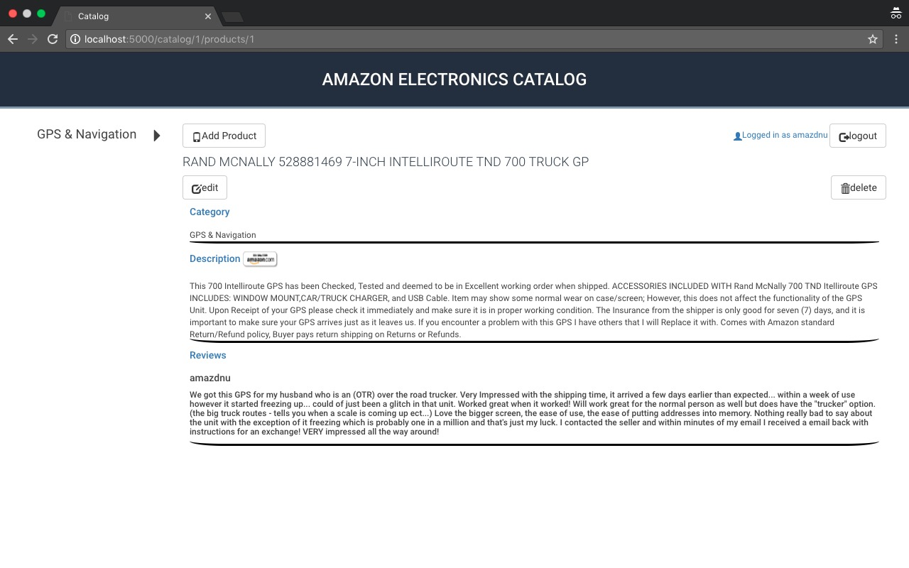
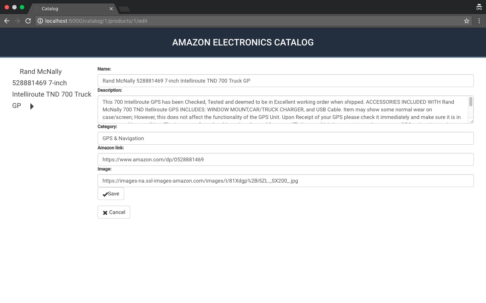
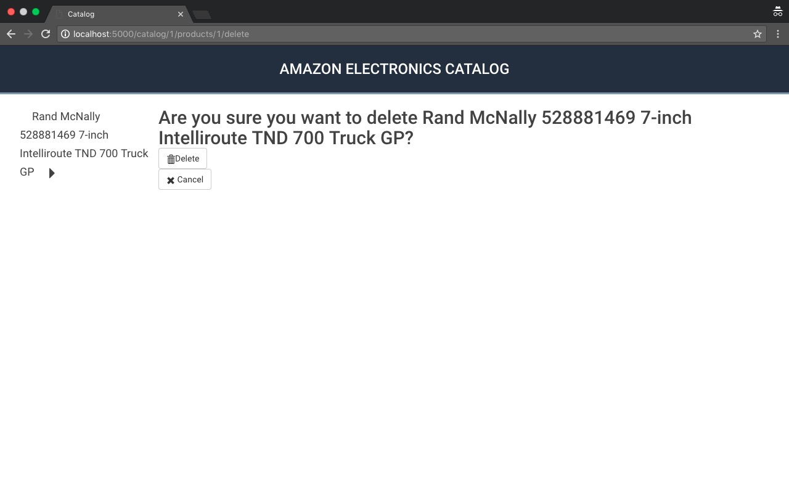

# Amazon Catalog app

### Description

Catalog for electronic products segregated into categories

### Features

* Users are allowed to view information on products without being logged. However, to add an item and its reviews on amazon the user shoould be logged in.



* Upon clicking a category in the left column, the user is taken to a page with list of all products in the category
 


* Upon clicking on a product, either in the home page for the category page, the user is redirected to page with information related to the particular product



* In the product page, if the user is logged and is the owner of that particular entry then the user can edit or delete the product



* User can edit individual details of the product.



* User can also delete the whole product info



* API endpoints are provided to either access information of a particular product or all products in a category or just list the categories available

> [Product API](img/product_api.jpg) <br/>
> [Category](img/category_api.jpg)

URI End Points| Template used | Description
---|---|---
/<br/>/catalog|[catalog.html](templates/catalog.html)| Takes user to the [Home](img/home_not_logged_in.jpg) page
/login|[login.html](templates/login.html)|Takes user to the [Login](img/login_page.jpg) page
/user/add|[user_add.html](templates/user_add.html)|Create new user
/catalog/\<int:categ_id\>/|[category.html](templates/category.html),<br/> [public_category.html](templates/public_category.html) |Lists of all Products in a category
/catalog/\<int:categ_id>/products/\<int:product_id>|[product_show_public.html](templates/product_show_public.html),<br/>[product_show.html](templates/product_show.html)|Shows information regarding a particular product
/catalog/new |[new_product.html](templates/new_product.html)|Adding a new product
/catalog/\<int:categ_id>/products/\<int:product_id>/edit |[edit_product.html](templates/edit_product.html)|Edit a product
/catalog/\<int:categ_id>/products/\<int:product_id>/delete |[delete_product.html](templates/delete_product.html)|Delete a product
/catalog/\<int:cat>/JSON|N/A|API endpoint to list all the products in a category in JSON format
/catalog/\<int:cat>/products/\<int:product_id>/JSON |N/A|API endpoint for details on a particular product in JSON format
/catalog/JSON |N/A|API endpoint to list all the categories 

#### Login Credentials

Some Usernames already in the database<br/>
*```amazdnu```*, *```AmazonCustomer```*, *```AllyMG```*, *```Gena```*, *```AWG```*, *```ahoffoss```*, *```James```* <br/>
Default password for the above users is ```1234```

### Requirements

The Python requirements are given in the file [```python_requirements.txt```](python_requirements.txt)

The server should be run on a Vagrant VM. The required vagrant files are<br/>

[```Vagrantfile```](Vagrantfile)<br/>
[```pg_config.sh```](pg_config.sh)

### Data

The Dataset for the project has been collected from [SNAP](https://snap.stanford.edu).

A reduced [Amazon Electronics](https://snap.stanford.edu/data/web-Amazon.html) Dataset was used which can be found here [```elec.json```](Data/elec.json).

[```gen_database.py```](Data/gen_database.py) uses the information present in [```elec.json```](Data/elec.json) cleans the data and saves it in [```amazon.txt```](amazon.txt).

Database is setup using [```database_setup.py```](database_setup.py) with *```sqlite```* as database engine. [```populator.py```](populator.py) along with [```amazon.txt```](amazon.txt) is then used to populate the database.
